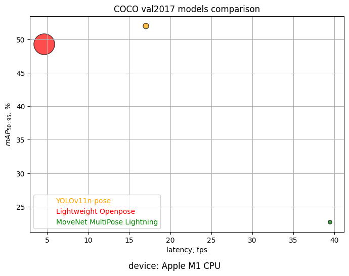
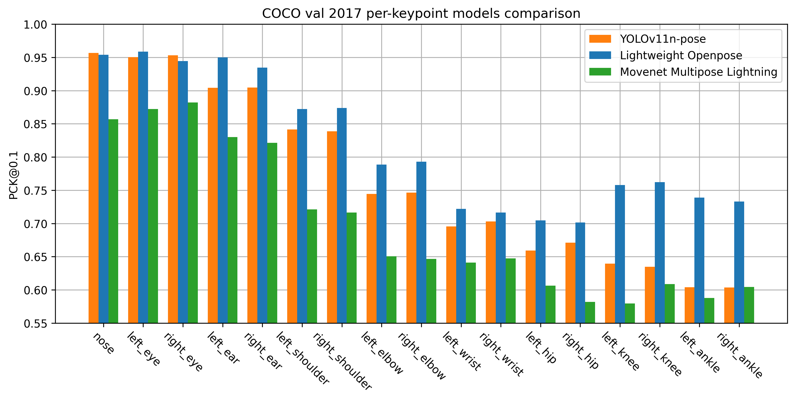
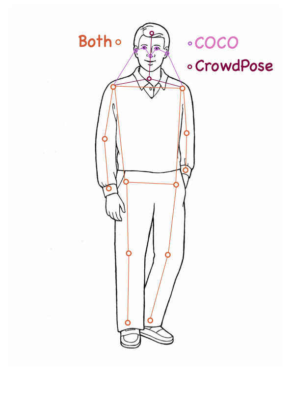

# Comparison of lightweight multi-person 2D pose-estimation models

### Models under test:

- lightweight-human-pose-estimation: https://github.com/Daniil-Osokin/lightweight-human-pose-estimation.pytorch (OpenPose)
- yolov11n-pose: https://github.com/ultralytics/ultralytics
- MoveNet: https://github.com/tensorflow/tfjs-models/tree/master/pose-detection/src/movenet (Google)

### Datasets:

- COCO val2017: https://cocodataset.org/#download
- CrowdPose: https://github.com/jeffffffli/CrowdPose

### Results:

#### mAP score and latency comparison

The area of each circle represents the model size in MB.

  

#### Per-keypoint score comparison

  

PCK@0.1 means Percentage of Correct Keypoints. A keypoint is considered correct if its L2 distance to the reference keypoint does not exceed 0.1×threshold. The threshold is the square root of the area covered by the person.

#### YOLO (COCO-pretrained) vs YOLO (COCO-pretrained + CrowdPose fine-tuned)

  

COCO-pretrained YOLO returns predictions in the COCO keypoints format.
Instead of COCO’s nose/eyes/ears keypoints, we need neck and top of head.
We approximate them as follows:

- Neck = midpoint of the left and right shoulder keypoints
- Top of head = midpoint of the left and right eye keypoints

Results of models comparison on CrowdPose test dataset placed in the table below.

| model                          | mAP 50:95 | size, MB | latency, fps |
|--------------------------------|----------:|---------:|-------------:|
| YOLOv11n-pose (COCO)           |      32.3 |      6.3 |         14.8 |
| YOLOv11n-pose (CrowdPose)      |      38.3 |      5.6 |         15.2 |